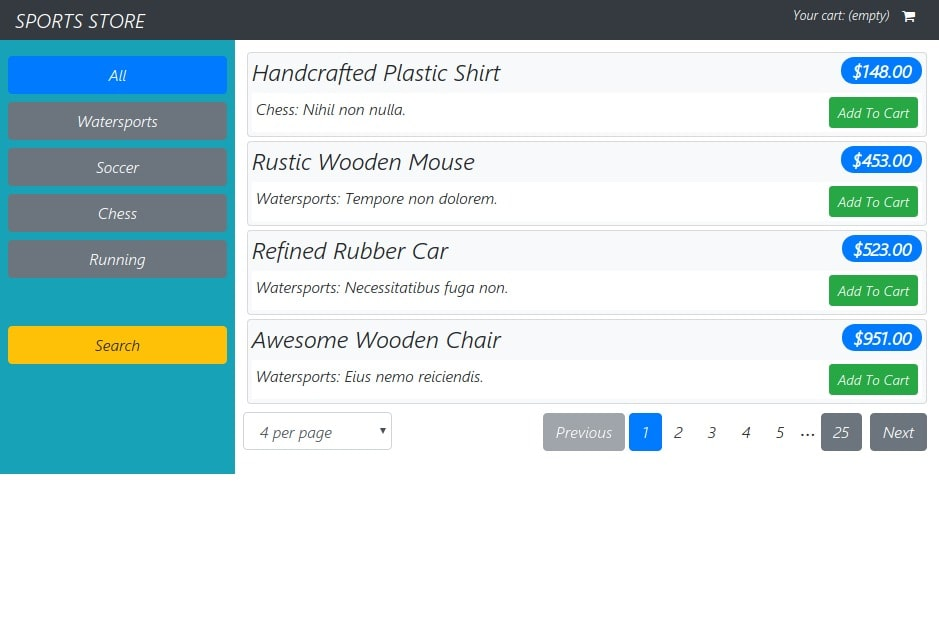
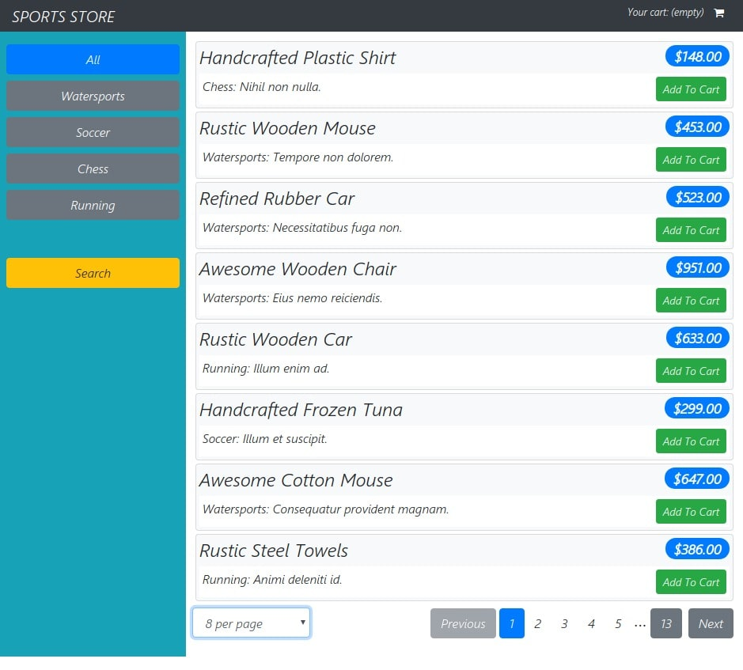
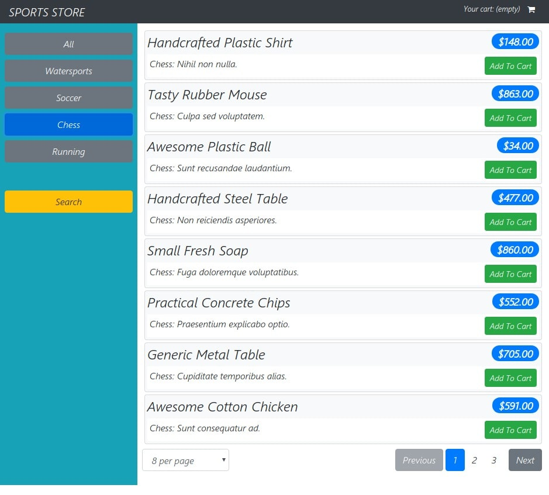
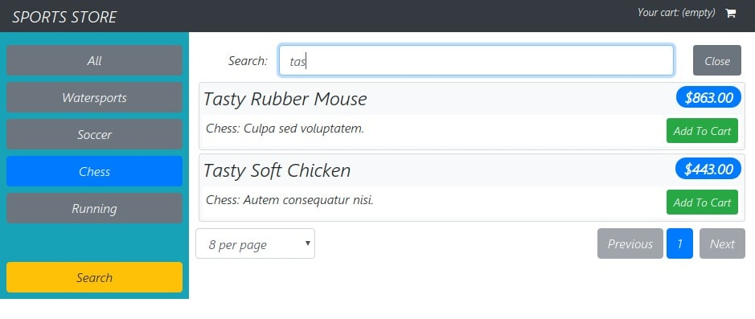
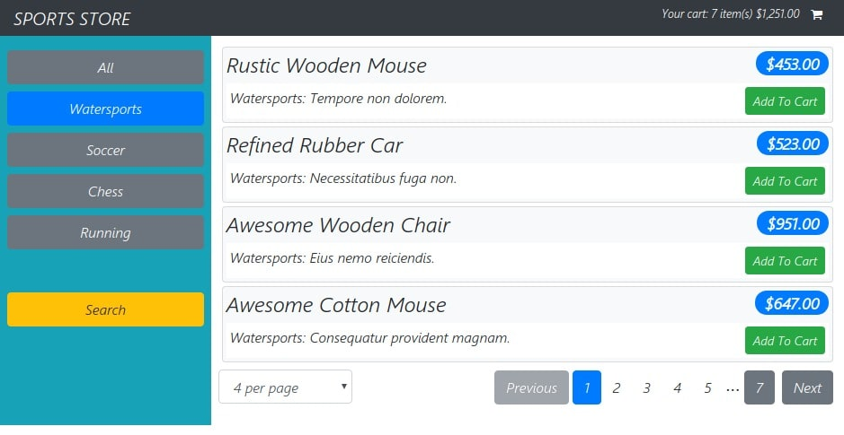
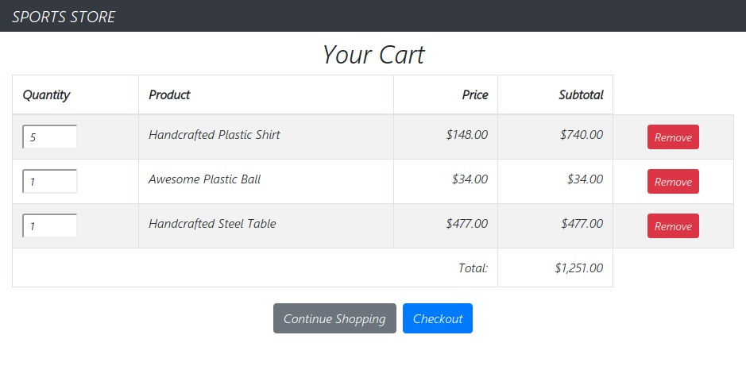
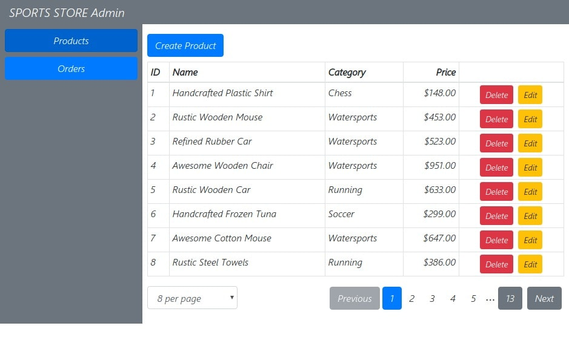

# ue sport store

The store has a shopping cart, `search` for records, selection of the number of records `per page`, page `pagination`. `Filtering data by categories` has been implemented. The order form is `validated` before shipment.
The `admin panel` displays all records, edits and adds new records. All orders on the site are also displayed in the admin panel.
Using `json-server` we emit server work. All data for the site is generated by the `faker.js` library in the `data.js file`. `authMiddleware.js file` monitors POST GET requests to the server, sends and verifies the `token`

## How to start app
At first start local server with data `npm run json-server` and then `npm run dev`

## Routes
* `/` store page 
* `/cart` cart of products
* `/checkout` order form
* `/thanks/id` show after send order form. id order in list order into admin panel
* `/login` login form access to admin panel if `username: admin , password: secret`
* `/admin` 
  * `/admin/products` products table
  * `/admin/products/create` create new product
  * `/admin/products/edit/id` edit product using id product
  * `/admin/orders` table orders in the site

  
* categories `All`, show items on the page `4`   

* categories `All`, show items on the page `8`

* categories `Chess`, show items on the page `8`

* `Search` by records    

* add record to cart. Cart icon on the page header

* cart page

* admin panel with all products on the application

