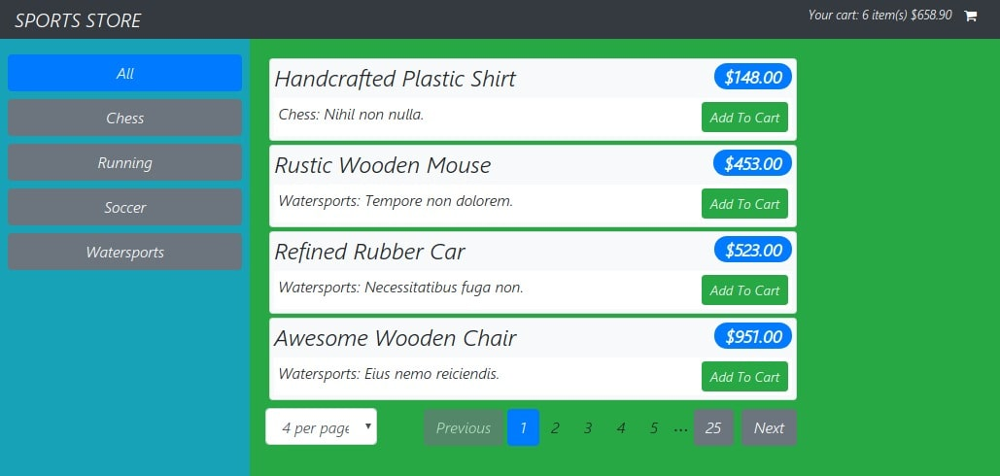

# ue sport store

Added list pagination boundaries and generate fake data use [faker.js](https://github.com/Marak/faker.js) into `data.js`

At first start local server with data `npm run json-server` and then `npm run dev`
  

